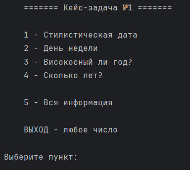

# 📅 Кейс-задача №1: Консольное приложение для работы с датами

  
  
<em>Главное меню приложения</em>

## 📝 Описание проекта

Консольное приложение на Python для работы с датами. Программа предлагает пользователю интерактивное меню с четырьмя полезными функциями, связанными с календарём и временем. Особенность проекта — **стилизованный вывод даты** в формате цифрового табло, составленного из символов `*`.

## ✨ Функциональность

### Главное меню:
1. **Стилистическая дата** — вывод введённой даты в формате цифрового табло (звёздочками)
2. **День недели** — определение дня недели для любой даты
3. **Високосный ли год?** — проверка, является ли год високосным
4. **Сколько лет?** — вычисление возраста на текущую дату
5. **Вся информация** — вывод всей информации за раз

**Выход** — любое число, кроме 1-5, завершает программу.

## 🛠 Технологии

- **Python 3.x** — основной язык программирования
- **Модули**: `datetime` для работы с текущей датой
- **Собственная модульная структура**: код разбит на логические модули для удобства поддержки

## 💡 Как использовать
1. Запустите программу
2. Вы увидите меню с 4 пунктами
3. Введите номер желаемого пункта (1-5)
4. Следуйте инструкциям на экране
5. Для выхода введите любое число, кроме 1-5

## 🔍 Детали реализации
### Валидация ввода
Все вводимые данные проходят тщательную проверку:

* Год: 4 цифры
* Месяц: число от 1 до 12
* День: проверка с учётом месяца (30 или 31 день)

### Определение дня недели
Используется алгоритм на основе:

* Кодов месяцев (с учётом високосности)
* Кодов годов
* Формулы для вычисления дня недели

### Високосный год
Проверка по правилу: год делится на 4, но не на 100, за исключением случаев, когда делится на 400.

### Стилистическая дата
Дата выводится в формате цифрового табло, где каждая цифра представлена матрицей 5×5 из символов *. Например:

     ***    ***  
    *   *  *   * 
    *   *  *   * 
    *   *  *   * 
     ***    ***  

## 👨‍💻 Автор

  
   
  ✨ С любовью к коду ✨

